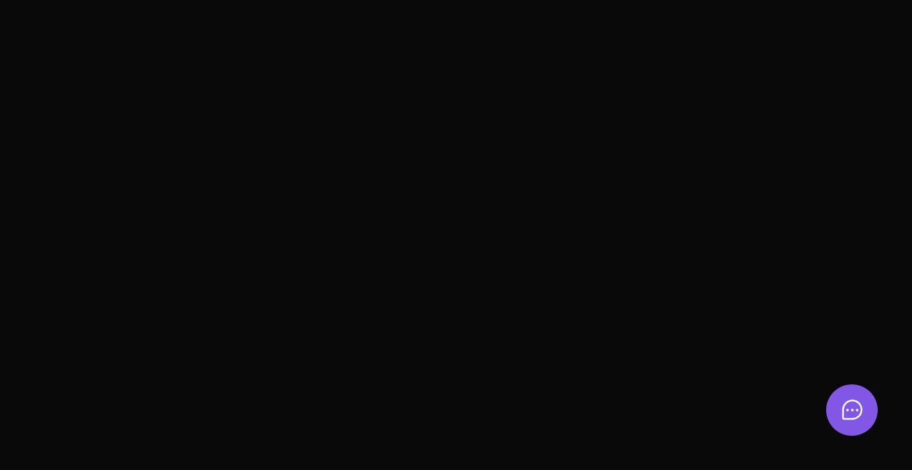
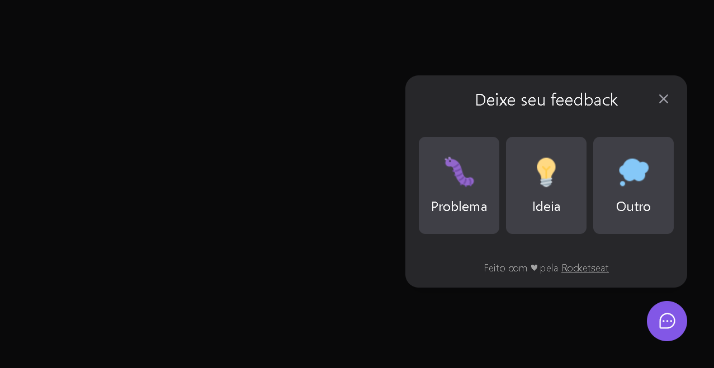
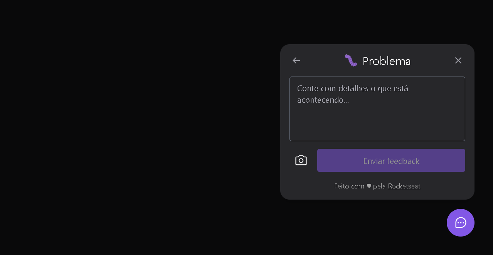
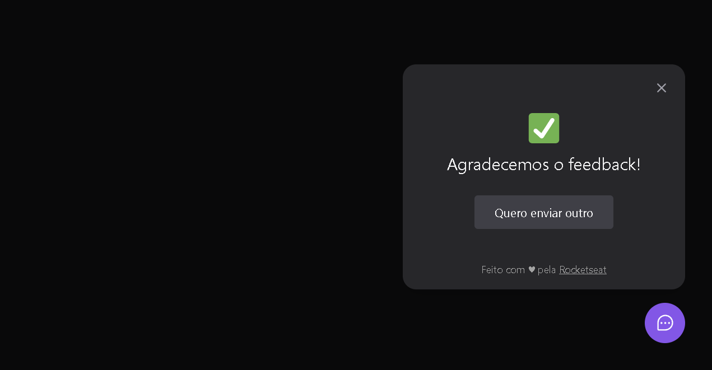

# Feedback Widget
- Widget developed to receive feedbacks.
- This is a project developed during Next Level Week, offered by **[Rocketseat](https://www.rocketseat.com.br)**.

## ✨ Built with
- [React](https://reactjs.org/)      
- [Tailwindcss](https://tailwindcss.com/)      
- [Typescript](https://www.typescriptlang.org/)
- [Axios](https://axios-http.com/docs/intro)
- [NodeJs](https://nodejs.org/en/)
- [Express](https://expressjs.com)
- [Prisma](https://www.prisma.io/)
- [SQLite](https://www.sqlite.org/index.html)
- [React Native](https://reactnative.dev/)
- [Expo](https://expo.io/)

## 🔖 Layout
- You can view the layout of the project through **[this link](https://www.figma.com/community/file/1102912516166573468)**. You need an account on **[Figma](http://figma.com/)** to access it.

 ## 🚀 Deploy
 - Deploy Web (Vercel): https://feedback-widget-orcin-six.vercel.app

 ## 🛠️ Features
- Sending feedback
- Screenshot with html2canvas
- Using MailTrap to send emails with feedbacks

## 📷 Screenshots
<div align="center" >
   
   
   
   
</div>

## 🚀 How to run
```bash
# Clone Repository
$ git clone https://github.com/daniel-nicacio/feedback-widget.git
```
### web
```bash
# Insert in terminal
$ cd web
# Install Dependencies
$ npm i
# Make a copy of '.env.local.example' to '.env.local'
# and set with YOUR environment variables.
# Run Aplication
$ npm run dev
```
### server
```bash
# Insert in terminal
$ cd server
# Install Dependencies
$ npm i
# Make a copy of '.env.example' to '.env'
# and set with YOUR environment variables.
# run the migrations
$ npx prisma migrate dev
# Run Aplication
$ npm run dev
```
### mobile
```bash
# Insert in terminal
$ cd mobile
# Install Dependencies
$ npm i
# Run Aplication
$ expo start
# Change baseURL in src/lib/api to your 'http://ipv4:3333' 
# Access through the Expo Go app
```

## 👨‍💻 built by
- Linkedin: https://www.linkedin.com/in/daniel-nic%C3%A1cio-figueiredo/
- E-mail: daniel.nicacio.f@gmail.com

## 📄 License
This project is under the MIT license. See the [LICENSE](LICENSE) file for more details.